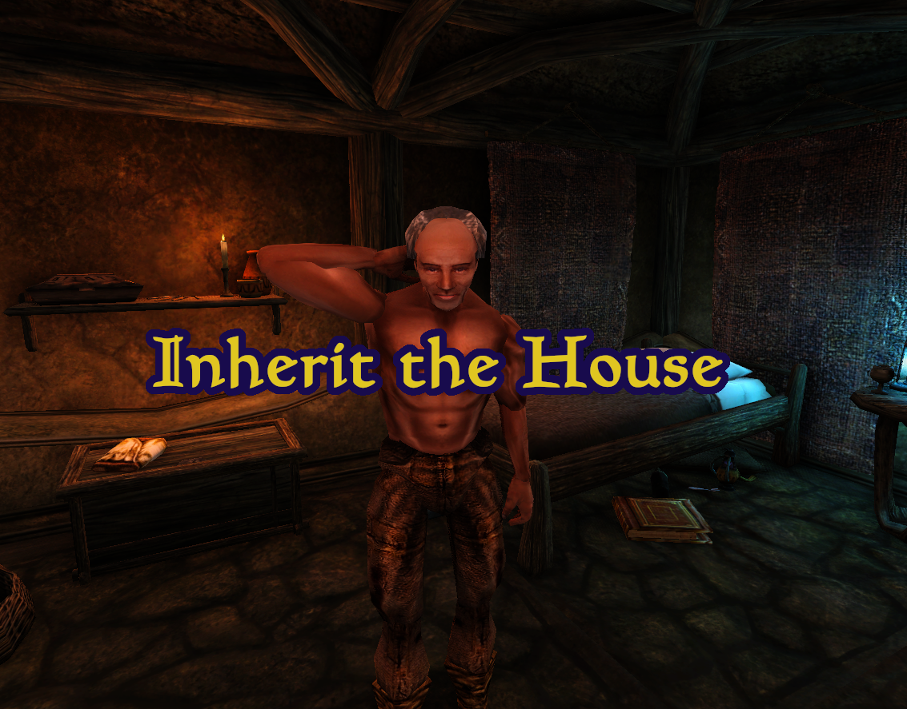

# Inherit the House (aka Generous Caius)

OpenMW mod that removes ownership of items, containers, and beds when these NPCs abandon them:
- Caius Cosades (Balmora)
- Tashpi Ashibael (Maar Gan)
- Vodunius Nuccius (Seyda Neen)
- Ugenring (Charach)

Compatible with everything since it only uses Lua.
This won't remove ownership if you've already progressed past the checkpoints in the relevant quests.

